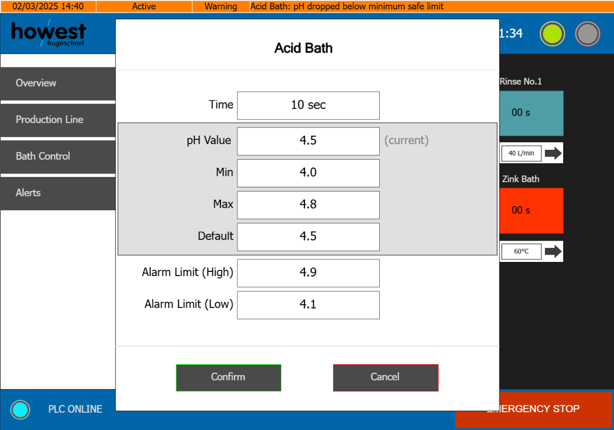

# PRJ-26001 · Galvanizing System PLC Controller

---

This is the PLC controller for a small-scale hot-dip galvanizing production line, built as part of a bachelor's thesis project at Howest Cyber3Lab in Brugge, Belgium. The whole thing runs on a WAGO CC100 programmed in Structured Text under CODESYS V3.5.

A single overhead hoist moves steel loads through eight process stations: an acid pickling bath, two wash/rinse pairs, a zinc bath, another wash/rinse pair, and a dryer. The controller handles all sequencing automatically, figures out which load to move next without deadlocking the line, and stops cleanly on an E-stop without losing its place.

In theory (not implemented phisically), the hardware side uses a belt-driven Nema 17 stepper with an SL2690A driver for horizontal travel, and a GY-370 DC gear motor flipped by two Finder relays for vertical movement. Both axes are timer-based for now, with real encoder feedback planned for production.

On the software side, operators get a full WebVisu interface with per-station bath settings, configurable soak times, a live alarm system with upper and lower limits on all process parameters, and a Modbus TCP server for external SCADA access.

| Field | Value |
|---|---|
| **Client** | Howest - Cyber3Lab, Brugge, Belgium |
| **Project Number** | PRJ-26001 |
| **PLC** | WAGO CC100 (751-9402) |
| **IDE** | CODESYS V3.5 |
| **Standard** | IEC 60204-1 |

For the full technical reference including the GVL, state machine, Modbus register map, I/O channel assignments, and commissioning checklist, see [README-Detailed.md](README-Detailed.md).
