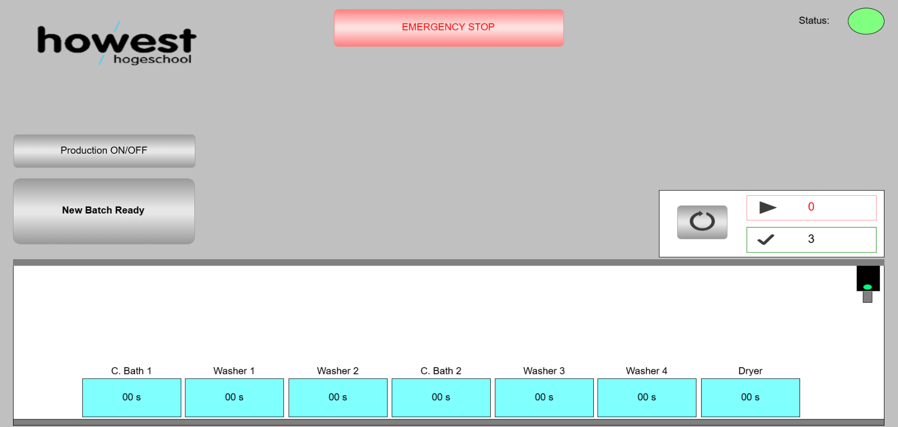

# PRJ-26001 · Galvanizing System PLC Controller




---

| Field | Value |
|---|---|
| **Client** | Howest - Cyber3Lab |
| **Site** | Building J - Cyber3Lab, Howest Brugge, Belgium |
| **Project Number** | PRJ-26001 |
| **PLC Platform** | WAGO Compact Controller 100 (751-9402) |
| **Programming Environment** | CODESYS V3.5 |
| **Control Voltage** | 24 VDC |
| **Power Supply** | 400 VAC, 3-Phase, 50 Hz |
| **Enclosure Rating** | IP65 (Field) / IP54 (Panel) |
| **Standard** | IEC 60204-1 / AS/NZS 3000 |

---

## Table of Contents

1. [Project Overview](#1-project-overview)
2. [Production Line Layout](#2-production-line-layout)
3. [Hardware Architecture](#3-hardware-architecture)
4. [Electrical Documentation (ePlan)](#4-electrical-documentation-eplan)
5. [Software Architecture](#5-software-architecture)
6. [Global Variable List (GVL)](#6-global-variable-list-gvl)
7. [PLC_PRG - State Machine Reference](#7-plc_prg---state-machine-reference)
8. [Hoist Control Logic](#8-hoist-control-logic)
9. [Cabling and Wiring Documentation](#9-cabling-and-wiring-documentation)
10. [I/O Channel Map](#10-io-channel-map)
11. [Safety and Emergency Stop](#11-safety-and-emergency-stop)
12. [Simulation Mode](#12-simulation-mode)
13. [Modbus TCP Server](#13-modbus-tcp-server)
14. [Visualization and HMI](#14-visualization-and-hmi)
15. [Standards and Compliance](#15-standards-and-compliance)
16. [Project File Structure](#16-project-file-structure)
17. [Development Notes](#17-development-notes)

---

## 1. Project Overview

This project implements a fully automated **hot-dip galvanizing production line** controller. A single overhead hoist transports steel loads sequentially through a series of chemical bath and wash stations before delivering them to a dryer and final unload position.

The controller is built on a **WAGO CC100 (751-9402)** PLC programmed entirely in **Structured Text (ST)** under **CODESYS V3.5**, with an auxiliary Ladder Diagram (LD) sub-program (`Main_LD`) for any hardwired interlock logic. The system is designed for DIN-rail mounting inside an IP54-rated control panel and interfaces with field devices at IP65.

**Key design goals:**

> **Deadlock-free sequencing** via reverse-priority scanning (station 7 to 1)
>
> **Resume-capable emergency stop** that freezes all motion without losing state
>
> **Simulation mode** retained for WebVisu visualization and offline commissioning
>
> **Modbus TCP server** for external register-level access to all setpoints and status
>
> **Unified documentation** - ePlan schematics, CODESYS project, and Excel cabling package all share project reference PRJ-26001

---

## 2. Production Line Layout

```
    [0]            [1]         [2]         [3]         [4]         [5]         [6]      [7]        [8]
Start (Load)  > Acid Bath  > Washer 1  > Rinse 1  > Zink Bath  > Washer 2  > Rinse 2  > Dryer  > End (Unload)
```

| Position  | Index | Description                     | Soak Time |
|-----------|:-----:|---------------------------------|:---------:|
| Start     | 0     | Load/input station (operator)   | n/a       |
| Acid Bath | 1     | Primary zinc galvanizing bath   | 10 s      |
| Washer 1  | 2     | First rinse station             | 10 s      |
| Rinse 1   | 3     | Second rinse station            | 10 s      |
| Zink Bath | 4     | Flux / secondary treatment bath | 10 s      |
| Washer 2  | 5     | Third rinse station             | 10 s      |
| Rinse 2   | 6     | Fourth rinse station            | 10 s      |
| Dryer     | 7     | Hot-air drying station          | 10 s      |
| End       | 8     | Unload / completion position    | n/a       |

> **Note:** All station soak/wash/dry times default to `T#10S` and are independently configurable per station via HMI dialog or Modbus Holding Register writes. Limits are clamped between `cSoakTimeMin` (1 s) and `cSoakTimeMax` (3600 s).

---

## 3. Hardware Architecture

### PLC - WAGO Compact Controller 100

| Property | Value |
|---|---|
| Model | WAGO CC100 - 751-9402 |
| Mounting | DIN Rail, IP20 |
| Supply Voltage | 24 VDC |
| Programming | CODESYS V3.5 (IEC 61131-3) |
| Connector Type | picoMAX CAGE CLAMP push-in |
| Protocols | Modbus TCP, EtherNet/IP, PROFINET, EtherCAT, BACnet, MQTT |
| On-board DI | 8 x 24 VDC (X12, sinking, 2.8 mA, RC filter 5 us) |
| On-board DIO | 8 x configurable DI/DO (X5) |
| On-board AI/AIO | 2 x AI + 2 x AIO (X6) |
| On-board NI/PT | 2 x NI1000/PT1000 (X13) |

### Network - WAGO Ethernet Switch

| Component | Model | Location | Connections |
|---|---|---|---|
| Ethernet Switch | WAGO 852-1812 | Network Cabinet | CC100 (X1), External Uplink, Service Port |

### Horizontal Axis - Stepper Motor Drive

| Component | Model | Notes |
|---|---|---|
| Linear Guide | 20x40 Belt-Driven, Nema 17 | Moves hoist left/right across 9 positions |
| Stepper Driver | SL2690A | 6.5 A, 1/128 microstep, 20-90 VDC motor supply |
| Control Interface | STEP/DIR/ENA | 24 VDC logic from CC100 DIO4-6 |
| Motor Supply | Dedicated 48 VDC PSU | Separate from 24 VDC logic rail |

> The SL2690A is controlled via STEP pulse toggling on every PLC scan cycle. DIP switches must be set to full-step or 1/2-step mode to maintain adequate pulse rate from the cyclic PLC task. Direction is set by the DIR signal; no relays are needed for the stepper axis.

### Vertical Axis - DC Motor Drive

| Component | Model | Notes |
|---|---|---|
| DC Gear Motor | GY-370 (Open Circuit) | 24 VDC, 30 RPM, worm gearbox, self-locking on power loss |
| Motor Driver | 2x Finder 48 Series relay | DPDT, 24 VDC coil, 22.2 mA, DIN rail mounted |
| Wiring | Relay reversing circuit | Relay A = lower (forward), Relay B = lift (reverse) |
| Dead-time | 200 ms (software) | Enforced in PLC_PRG between direction changes |

> The worm gearbox provides mechanical self-locking when power is removed, making it inherently safe for a lifting axis without a brake. The two relays swap motor polarity for up/down direction. A 200 ms software dead-time prevents both relay coils from energising simultaneously.

**Cable Schedule (Network):**

| Cable No. | From | From Port | To | Type | Length |
|:---------:|------|:---------:|-----|:----:|:------:|
| W101 | WAGO 852-1812 | X3 | WAGO CC100 751-9402 | UTP | 0.5 m |
| W102 | WAGO 852-1812 | X1 | EXT\_NETWORK\_UPLINK | UTP | 3 m |
| W103 | WAGO 852-1812 | X8 | EXT\_SERVICE\_CON | UTP | 2 m |

---

## 4. Electrical Documentation (ePlan)

The ePlan project `26001_Galvanizing_System_Interconnections` is organized into the following functional groups, all referencing panel cabinet **PCW1**:

```
26001_Galvanizing_System_Interconnections
|
+-- PWR  (PCW1)  Power Distribution
|   +-- Page 1: Power Supply Input 230V AC
|   +-- Page 2: Power Supply Input 230V AC (redundant / secondary)
|   +-- Page 3: 24V DC System Power Distribution
|   +-- Page 4: 24V DC Switch System Power
|   +-- Page 5: 24V DC PLC System Power
|
+-- MAIN (DOC)  Project Documentation
|   +-- Page 1: Title Page
|
+-- PLC  (PCW1)  PLC I/O Schematics
|   +-- Page 1: Digital Inputs 24V DC
|   +-- Page 2: Digital Outputs 24V DC
|   +-- Page 3: PLC Communication
|
+-- NET  (PCW1)  Network Infrastructure
|   +-- Page 1: Network Topology and Ethernet Switch
|   +-- Page 2: Network Topology and Ethernet Switch (cont.)
|
+-- HMI  (PCW1)  Operator Interface
    +-- Page 1: Main Operator Touch Panel
    +-- Page 2: Main Operator Touch Panel System Power
```

> All ePlan drawing references use the prefix `PRJ-26001`. Any changes to electrical topology must be reflected in both the ePlan schematics and the cabling Excel workbook.

---

## 5. Software Architecture

### CODESYS Project Structure

```
26001_Galvanizing_System  (CODESYS Project)
|
+-- GVL                  Global Variable List - shared I/O and flags
+-- PLC_PRG              Main program - Structured Text
|   +-- Station timers   TON array, 7 elements
|   +-- State machine    10-state hoist sequencer
|   +-- Real I/O logic   Stepper pulse gen + relay reversal with dead-time
|   +-- Simulation logic Retained for WebVisu visualization
|   +-- Load counters    Active + completed
|   +-- Modbus export    iSoakTimeSec conversion + wAlarmWord packing
+-- EStopSequence        Emergency stop blink logic (Structured Text)
+-- Main_LD              Ladder Diagram - hardwired interlocks
```

### Language Usage

| Program Unit | Language | Purpose |
|---|---|---|
| `PLC_PRG` | Structured Text | Hoist sequencing, timers, counters, I/O |
| `EStopSequence` | Structured Text | Emergency light blink pattern |
| `Main_LD` | Ladder Diagram | Hardwired safety interlocks (if retained) |
| `GVL` | Variable declaration | Shared I/O mapping across all POUs |

---

## 6. Global Variable List (GVL)

Attribute: `{attribute 'qualified_only'}` - all variables must be accessed as `GVL.<variable>`.

### Sensor Inputs

| Variable | Type | Description |
|---|---|---|
| `xStartSensor` | `BOOL` | Material detected at start position (pos 0) |
| `xEndSensor` | `BOOL` | Material delivered to end position (pos 8) |
| `xMasterSwitch` | `BOOL` | Production line enable switch (ANDed with xStartSensor) |
| `xStationOccupied` | `ARRAY[1..7] OF BOOL` | Station occupancy flags (1=Bath1 to 7=Dryer) |

### Feedback Inputs

| Variable | Type | Description |
|---|---|---|
| `iActualPosition` | `INT` | Current hoist horizontal position (0=Start, 8=End) |
| `xIsFullyLifted` | `BOOL` | Hoist at top limit (set by vertical move timer) |
| `xIsFullyLowered` | `BOOL` | Hoist at bottom limit (set by vertical move timer) |

### Command Outputs

| Variable | Type | Description |
|---|---|---|
| `xLowerHoist` | `BOOL` | TRUE = lower hoist, FALSE = lift hoist |
| `xGrabLoad` | `BOOL` | TRUE = gripper/clamp closed, FALSE = open |
| `iTargetPosition` | `INT` | Commanded horizontal target position |

### Horizontal Axis (Stepper - SL2690A)

| Variable | Type | Description |
|---|---|---|
| `xStepPulse` | `BOOL` | DO - PUL+ on SL2690A, toggled each scan while moving |
| `xStepDir` | `BOOL` | DO - DIR+ on SL2690A (TRUE = right, FALSE = left) |
| `xStepEnable` | `BOOL` | DO - ENA+ on SL2690A (always TRUE during operation) |

### Vertical Axis (DC Motor - GY-370 via relays)

| Variable | Type | Description |
|---|---|---|
| `xRelayDown` | `BOOL` | DO - Relay A coil, energises to lower hoist |
| `xRelayUp` | `BOOL` | DO - Relay B coil, energises to lift hoist |

### Safety

| Variable | Type | Description |
|---|---|---|
| `xEmergencyStop` | `BOOL` | Global emergency stop - freezes all motion outputs |

### Lights

| Variable | Type | Description |
|---|---|---|
| `xEmergencyLight` | `BOOL` | Blinks at 0.5 Hz while E-stop is active |
| `xInProcessLight` | `BOOL` | TRUE when any station is occupied or hoist carries load |

### Wash Flow Control

| Variable | Type | Description |
|---|---|---|
| `iWashFlowSetpoint` | `ARRAY[1..4] OF INT` | Wash flow setpoints in L/min (default 40) |
| `xWashFlowAlarm` | `ARRAY[1..4] OF BOOL` | TRUE if setpoint exceeds safe limit |

### Bath and Process Control

| Variable | Type | Description |
|---|---|---|
| `iAcidConcentration` | `INT` | HCl concentration % (default 15, clamp 0-25) |
| `iZincTemperature` | `INT` | Zinc bath temperature °C (default 450, clamp 419-480) |
| `iDryerTemperature` | `INT` | Dryer air temperature °C (default 100, clamp 0-200) |
| `xAcidAlarm` | `BOOL` | TRUE if acid concentration exceeds alarm limit |
| `xZincAlarm` | `BOOL` | TRUE if zinc temperature exceeds alarm limit |
| `xDryerAlarm` | `BOOL` | TRUE if dryer temperature exceeds alarm limit |

### Soak Time Configuration

| Variable | Type | Description |
|---|---|---|
| `ptStationTime` | `ARRAY[1..7] OF TIME` | Per-station soak time (default T#10S each) |
| `iSoakTimeSec` | `ARRAY[1..7] OF INT` | Soak times in seconds, converted for Modbus export |
| `iSelectedStation` | `INT` | Station index selected via HMI tile (1-7) |
| `iSoakTimeInput` | `INT` | Operator-entered soak time in seconds |
| `xConfirmSoakTime` | `BOOL` | Confirm trigger from HMI; PLC clears after applying |

---

## 7. PLC_PRG - State Machine Reference

The main program executes the following sections on every PLC scan cycle:

| Section | Description |
|:-------:|---|
| 1 | Run station timers (TON, configurable per station) |
| 2 | Set `xHoistBusy` flag (TRUE when state is not 0) |
| 3 | Emergency stop check + main CASE state machine |
| 4 | Real I/O: vertical axis relay reversal with dead-time |
| 4b | Real I/O: horizontal axis stepper pulse generation |
| 4c | Simulation: instant position update for WebVisu visualization |
| 5 | Count active loads in system (occupied stations + gripper) |
| 5b | Drive in-process lamp from active load count |
| 6 | Count completed loads (rising-edge on `xEndSensor`) |
| 7 | Reset done counter (from visualization/HMI button) |
| 8 | Get system time via `SysTimeRtcGet` |
| 9 | Process parameter clamp and alarm generation |
| 10 | Soak time configuration from HMI dialog confirm |
| 11 | Call `EStopSequence()` |

### State Machine States

| State | Name | Action |
|:-----:|---|---|
| `0` | IDLE / Scan | Reverse-priority scan (station 7 to 1 to start) for the next job |
| `10` | Move to Pickup | Wait until `iActualPosition = iTargetPosition` |
| `20` | Lower at Pickup | Assert `xLowerHoist`; when `xIsFullyLowered`, close gripper |
| `25` | Grab Confirmation | One-scan hold with hoist lowered - ensures gripper engagement |
| `30` | Lift with Load | De-assert `xLowerHoist`; clears station occupancy when fully lifted |
| `40` | Move to Drop-off | Wait until hoist reaches destination position |
| `45` | Lower and Release | Assert `xLowerHoist`; when lowered, open gripper, set occupancy |
| `50` | Lift Empty / Return | De-assert `xLowerHoist`; returns to IDLE when fully lifted |

### Priority Scheme (State 0 - IDLE)

| Priority | Condition | Action |
|:--------:|---|---|
| 1 | Station 7 done | Unload dryer - move to pos 8 (End) |
| 2 | Station 6 done, station 7 free | Advance station 6 forward |
| 3 | Station 5 done, station 6 free | Advance station 5 forward |
| 4 | Station 4 done, station 5 free | Advance station 4 forward |
| 5 | Station 3 done, station 4 free | Advance station 3 forward |
| 6 | Station 2 done, station 3 free | Advance station 2 forward |
| 7 | Station 1 done, station 2 free | Advance station 1 forward |
| 8 | `xMasterSwitch` AND `xStartSensor` AND station 1 free | Pick new batch from Start |

> This reverse-priority order (end-first) is intentional to prevent pipeline deadlocks. Later stations always get preference, ensuring the line drains before new material is loaded.

---

## 8. Hoist Control Logic

### Full Cycle for One Load

```
IDLE
 |
 +-> [State 10] Move to pickup position (stepper pulses until timer expires)
 |
 +-> [State 20] Lower hoist (Relay A energised for T#2S)
 |
 +-> [State 25] Grip confirmation (one-scan hold)
 |
 +-> [State 30] Lift with load (Relay B energised for T#2S)
 |
 +-> [State 40] Move to drop-off position (stepper pulses until timer expires)
 |
 +-> [State 45] Lower and release (Relay A energised for T#2S)
 |
 +-> [State 50] Lift empty (Relay B energised for T#2S)
 |
IDLE
```

### Timer Behavior

Each station uses an independent `TON` timer:

- **Starts** when `GVL.xStationOccupied[n]` goes TRUE
- **Resets** explicitly in State 30 when the load is lifted (sets `IN := FALSE`)
- **Done flag** (`xStationDone[n]`) mirrors `timerStation[n].Q`

### Motion Timing

| Axis | Timer | Default | Tune on hardware |
|---|---|:---:|---|
| Horizontal (one station hop) | `fbHorizontalMove` | `T#3S` | Measure belt travel time per position |
| Vertical (full stroke) | `fbVerticalMove` | `T#2S` | Measure full lower/lift stroke time |
| Relay direction dead-time | `fbVerticalDeadTime` | `T#200MS` | Do not reduce below 100 ms |

### Occupancy Rules

| Event | Occupancy Change |
|---|---|
| Load lifted from station N | `xStationOccupied[N] := FALSE` |
| Load placed at station N | `xStationOccupied[N] := TRUE` |
| Load placed at position 8 | `xEndSensor := TRUE` (triggers done counter) |
| Load picked from Start (pos 0) | No occupancy array entry for pos 0 |

---

## 9. Cabling and Wiring Documentation

The Excel workbook **`PRJ-26001_Galvanizing-System_PLC-Cabling-Wiring.xlsx`** contains seven sheets:

| Sheet | Contents |
|---|---|
| `Config` | Central variable definitions - project name, PLC model, voltages, I/O map. All other sheets reference this via cell links. |
| `Cover` | Project cover page, document index, and general installation notes |
| `Cable Schedule` | Full cable listing: cable number, source, destination, type, cores, size, voltage rating, shield, length, conduit/tray, status |
| `IO List` | PLC I/O assignments: tag, description, cable/wire number, connector, CODESYS address, signal type, wire colors, terminal |
| `Terminal Block Layout` | DIN rail terminal assignments: terminal number, type, wire color, cross-section, cable number, ferrule, jumper notes |
| `Wiring Legend` | IEC 60446 wire color codes, cable type specifications, abbreviations, and standards references |
| `Cable Drum Register` | Drum tracking: drum ID, cable type, full length, issued length, remaining length, location, supplier |

### Wire Color Reference (IEC 60446)

| Function | Color | Voltage | Cross-Section |
|---|---|:---:|:---:|
| 24V DC Positive | Red | 24V DC | 20 AWG / 0.5 mm2 |
| 0V DC Negative | Black | 0V DC | 20 AWG / 0.5 mm2 |
| Protective Earth (PE) | Green/Yellow | Earth | 20 AWG / 0.5 mm2 |
| AC Line (L) | Brown | 230V AC | 3G 1 mm2 |
| AC Neutral (N) | Blue | 0V AC | 3G 1 mm2 |

### General Wiring Rules

- All cabling per **IEC 60204-1** and local wiring regulations
- Signal cables (4-20 mA) must be segregated from power cables - **minimum 200 mm separation**
- All cable screens/shields grounded at **one end only** (control panel end) unless noted otherwise
- Minimum cable bending radius: **6x OD** (multi-core), **8x OD** (armoured)
- All field terminations use **bootlace ferrules** (Weidmuller crimping tool or equivalent)
- Motor cables must be shielded (VFD-duty) where inverter drives are installed

---

## 10. I/O Channel Map

### WAGO CC100 On-board I/O Connector Map

| Connector | Channels | Type | CODESYS Prefix | Notes |
|:---------:|---|---|:---:|---|
| X11 | DI.1 to DI.8 | Digital Input | `%IX0.0 to IX0.7` | 24 VDC sinking, 2.8 mA, RC filter 5 us |
| X5 | DIO.1 to DIO.8 | Configurable DIO | `%IX6.x / QX` | Configurable as DI or DO |
| X6 | AI.1-AI.2 + AIO.1-AIO.2 | Analog | `%IW / %QW` | 4-20 mA or 0-10 V |
| X13 | NI/PT.1 to NI/PT.2 | Temperature | `%IW` | NI1000 / PT1000 |

### DIO Assignments (X5 - Configured as DO)

| Terminal | CODESYS Variable | Direction | Connected To |
|:---:|---|:---:|---|
| DIO4 | `GVL.xStepPulse` | DO | SL2690A PUL+ |
| DIO5 | `GVL.xStepDir` | DO | SL2690A DIR+ |
| DIO6 | `GVL.xStepEnable` | DO | SL2690A ENA+ |
| DIO7 | `GVL.xRelayDown` | DO | Relay A coil + (lower) |
| DIO8 | `GVL.xRelayUp` | DO | Relay B coil + (lift) |

> All SL2690A signal commons (PUL-, DIR-, ENA-) connect to 24V GND. Relay coil negatives connect to 24V GND.

### Current I/O Assignments (from IO List sheet)

| Tag | Connector | CODESYS Addr | Signal Type | Description |
|---|:---------:|:---:|:---:|---|
| X12:2 | X12 | n/a | DC 0V | PLC 0V reference |
| X12:3 | X12 | `%IX6.0` | DI 24VDC | Control button 24V input |
| 24VIN-1 | Bus | n/a | 24V DC | 24V DC Bus Input 1 |
| 24VIN-2 | Bus | n/a | 24V DC | 24V DC Bus Input 2 |
| 24VIN-3 | Bus | n/a | 24V DC | 24V DC Bus Input 3 |

> The full I/O assignment table is maintained in the `IO List` tab of the Excel workbook. CODESYS variable addresses in `GVL` must be kept synchronized with this sheet at all times.

---

## 11. Safety and Emergency Stop

### Emergency Stop Behavior

When `GVL.xEmergencyStop = TRUE`:

| Output | Forced Value | Effect |
|---|:---:|---|
| `GVL.xLowerHoist` | `FALSE` | Hoist stops descending immediately |
| `GVL.xGrabLoad` | `FALSE` | Gripper deactivated |
| `GVL.iTargetPosition` | frozen | No horizontal motion commanded |
| `GVL.xRelayDown` | `FALSE` | Lower relay de-energised |
| `GVL.xRelayUp` | `FALSE` | Lift relay de-energised |
| `GVL.xStepPulse` | `FALSE` | Stepper pulse stops |
| `iSystemState` | unchanged | State machine resumes on E-stop release |
| `GVL.xEmergencyLight` | blinking | 0.5 Hz blink via EStopSequence |

> **Important:** The GY-370 worm gearbox provides mechanical self-locking when relay power is removed, holding the load in place during an E-stop. After an E-stop, the operator must manually verify the hoist position and load status before releasing. If a full sequence reset is required, `iSystemState := 0` can be set via HMI or Modbus write.

### Hardwired Safety (Main_LD)

The `Main_LD()` Ladder Diagram sub-program is called at the end of every scan and is reserved for hardwired interlock logic that operates independently of the ST state machine. This may include:

- Physical E-stop coil monitoring
- Drive fault relay contacts
- Door/guard interlocks
- Overload contacts

---

## 12. Simulation Mode

Section 4c of `PLC_PRG` retains simulation logic that runs **in parallel** with the real I/O sections (4 and 4b). This allows the WebVisu visualization to reflect hoist movement and station occupancy without requiring physical hardware to be connected.

### Simulation Behavior

| Simulated Signal | Behavior |
|---|---|
| Horizontal position | `iActualPosition` increments/decrements by 1 per scan toward `iTargetPosition` |
| Vertical (lowered) | `xIsFullyLowered := xLowerHoist` (instant) |
| Vertical (lifted) | `xIsFullyLifted := NOT xLowerHoist` (instant) |

> The simulation section does NOT need to be removed for live hardware deployment. Real feedback is provided by the vertical move timer (`fbVerticalMove`) and horizontal move timer (`fbHorizontalMove`) in sections 4 and 4b. The simulation section runs harmlessly alongside and only affects WebVisu display variables.

---

## 13. Modbus TCP Server

A Modbus TCP Server device is configured in the CODESYS project under `ModbusTCP_Server_Device`. It exposes 12 Holding Registers (writable by external client) and 18 Input Registers (read-only status from PLC).

### Holding Registers (Writable - external client to PLC)

| Register | Modbus Address | Variable | Description |
|:---:|:---:|---|---|
| 0 | %IW8 | `GVL.iWashFlowSetpoint[1]` | Wash 1 flow setpoint (L/min) |
| 1 | %IW9 | `GVL.iWashFlowSetpoint[2]` | Wash 2 flow setpoint (L/min) |
| 2 | %IW10 | `GVL.iWashFlowSetpoint[3]` | Wash 3 flow setpoint (L/min) |
| 3 | %IW11 | `GVL.iWashFlowSetpoint[4]` | Wash 4 flow setpoint (L/min) |
| 4 | %IW12 | `GVL.iAcidConcentration` | HCl bath concentration (%) |
| 5 | %IW13 | `GVL.iZincTemperature` | Zinc bath temperature (°C) |
| 6 | %IW14 | `GVL.iDryerTemperature` | Dryer air temperature (°C) |
| 7 | %IW15 | `GVL.iSelectedStation` | Station index for soak time config (1-7) |
| 8 | %IW16 | `GVL.iSoakTimeInput` | Soak time to apply in seconds |
| 9 | %IW17 | `GVL.xConfirmSoakTime` | Write 1 to confirm soak time update |
| 10 | %IW18 | `GVL.xMasterSwitch` | Remote production line enable (1=on) |
| 11 | %IW19 | `GVL.xEmergencyStop` | Remote E-stop trigger (1=stop) |

### Input Registers (Read-only - PLC to external client)

| Register | Modbus Address | Variable | Description |
|:---:|:---:|---|---|
| 0 | %QW1 | `GVL.iActualPosition` | Current hoist position (0-8) |
| 1 | %QW2 | `GVL.iTargetPosition` | Commanded target position (0-8) |
| 2 | %QW3 | `PLC_PRG.iSystemState` | State machine current state |
| 3 | %QW4 | `PLC_PRG.iActiveLoads` | Number of loads currently in system |
| 4 | %QW5 | `PLC_PRG.iTotalDone` | Completed load counter |
| 5 | %QW6 | `PLC_PRG.wAlarmWord` | Packed alarm bits (see table below) |
| 6 | %QW7 | `GVL.iSoakTimeSec[1]` | Station 1 soak time (seconds) |
| 7 | %QW8 | `GVL.iSoakTimeSec[2]` | Station 2 soak time (seconds) |
| 8 | %QW9 | `GVL.iSoakTimeSec[3]` | Station 3 soak time (seconds) |
| 9 | %QW10 | `GVL.iSoakTimeSec[4]` | Station 4 soak time (seconds) |
| 10 | %QW11 | `GVL.iSoakTimeSec[5]` | Station 5 soak time (seconds) |
| 11 | %QW12 | `GVL.iSoakTimeSec[6]` | Station 6 soak time (seconds) |
| 12 | %QW13 | `GVL.iSoakTimeSec[7]` | Station 7 soak time (seconds) |
| 13 | %QW14 | `GVL.xLowerHoist` | Current vertical command (1=lower) |
| 14 | %QW15 | `GVL.xGrabLoad` | Current gripper state (1=closed) |
| 15 | %QW16 | `GVL.xStepEnable` | Stepper driver enabled status |
| 16 | %QW17 | `GVL.xRelayDown` | Lower relay active status |
| 17 | %QW18 | `GVL.xRelayUp` | Lift relay active status |

### Alarm Word Bit Map (wAlarmWord - Input Register 5)

| Bit | Source Variable | Alarm Condition |
|:---:|---|---|
| 0 | `GVL.xWashFlowAlarm[1]` | Wash 1 flow exceeds safe limit |
| 1 | `GVL.xWashFlowAlarm[2]` | Wash 2 flow exceeds safe limit |
| 2 | `GVL.xWashFlowAlarm[3]` | Wash 3 flow exceeds safe limit |
| 3 | `GVL.xWashFlowAlarm[4]` | Wash 4 flow exceeds safe limit |
| 4 | `GVL.xAcidAlarm` | HCl concentration exceeds alarm limit |
| 5 | `GVL.xZincAlarm` | Zinc temperature exceeds alarm limit |
| 6 | `GVL.xDryerAlarm` | Dryer temperature exceeds alarm limit |
| 7 | `GVL.xEmergencyStop` | Emergency stop active |

---

## 14. Visualization and HMI

### CODESYS Visualization

The project includes a CODESYS web/panel visualization connected to the following variables:

| UI Element | Variable | Function |
|---|---|---|
| Station indicators | `GVL.xStationOccupied[1..7]` | Show occupied/free status |
| Hoist position | `GVL.iActualPosition` | Numeric display / graphic |
| Active loads counter | `iActiveLoads` | Count of loads currently in system |
| Completed loads | `iTotalDone` | Running total of finished batches |
| Reset counter button | `xResetDoneCounter` | Resets `iTotalDone` to 0 |
| Emergency stop | `GVL.xEmergencyStop` | E-stop indicator / button |
| Master switch | `GVL.xMasterSwitch` | Production enable toggle |
| In-process lamp | `GVL.xInProcessLight` | Green lamp, on when loads in system |
| Emergency light | `GVL.xEmergencyLight` | Blinks at 0.5 Hz during E-stop |
| Soak time dialog | `GVL.iSoakTimeInput` + `GVL.xConfirmSoakTime` | Per-station time configuration |
| Alarm dialogs | `GVL.sAlarmMessage` | Context-specific message per alarm |
| System clock | `PLC_PRG.sFormattedTime` | Live HH:MM:SS display |

### HMI Panel (ePlan - HMI/PCW1)

The ePlan HMI section documents:

- **Page 1:** Main Operator Touch Panel wiring and signals
- **Page 2:** Touch panel 24V DC system power wiring

The physical HMI communicates with the CC100 via Ethernet CODESYS WebVisu over the WAGO 852-1812 switch network.

---

## 15. Standards and Compliance

| Standard | Application |
|---|---|
| IEC 61131-3 | PLC programming languages (ST, LD, FBD, SFC, IL) |
| IEC 60204-1 | Safety of machinery - electrical equipment |
| IEC 60446 | Wire identification by color codes |
| IEC 60529 | Enclosure IP rating classification |
| AS/NZS 3000 | Wiring rules (supplementary local reference) |

---

## 16. Project File Structure

```
PRJ-26001_Galvanizing_System/
|
+-- CODESYS/
|   +-- 26001_Galvanizing_System.project    Main CODESYS project file
|   +-- GVL.gvl                             Global Variable List
|   +-- PLC_PRG.st                          Main ST program
|   +-- EStopSequence.st                    Emergency stop blink program
|   +-- Main_LD.ladder                      Ladder Diagram sub-program
|
+-- ePlan/
|   +-- 26001_Galvanizing_System_Interconnections/
|       +-- PWR/     Power supply schematics (pages 1-5)
|       +-- MAIN/    Title page
|       +-- PLC/     I/O schematics (pages 1-3)
|       +-- NET/     Network topology (pages 1-2)
|       +-- HMI/     Touch panel wiring (pages 1-2)
|
+-- Documentation/
|   +-- PRJ-26001_Galvanizing-System_PLC-Cabling-Wiring.xlsx
|   +-- README.md
|
+-- Datasheets/
    +-- WAGO_CC100_751-9402_Datasheet.pdf
    +-- WAGO_852-1812_Switch_Datasheet.pdf
    +-- SL2690A_Stepper_Driver_Datasheet.pdf
    +-- Finder_48_Series_Relay_Datasheet.pdf
    +-- GY370_DC_Gearmotor_Datasheet.pdf
```

---

## 17. Development Notes

### Known Limitations / TODO

- **Horizontal hop time** `T#3S` in `fbHorizontalMove` must be measured and tuned on real hardware - one value covers all station hops, assuming uniform belt speed and equal spacing.
- **Vertical stroke time** `T#2S` in `fbVerticalMove` must be measured and tuned on real hardware for both lower and lift strokes.
- **Single-hoist only.** The state machine is designed for one hoist. Multi-hoist operation would require a significant redesign with collision avoidance logic.
- **`GVL.xEndSensor`** is written by the PLC program itself (set in State 45 when position = 8). On real hardware this should be an actual field sensor, and the write from `PLC_PRG` should be removed.
- **`Main_LD()`** is called but may be empty. Populate with interlock logic before commissioning.
- **No physical position sensors.** The system relies entirely on timed motion for both axes. If belt slip or motor stall occurs, `iActualPosition` will drift from the real physical position. For production use, proximity sensors at each station (9x) plus top/bottom limit switches (2x) are recommended.
- **SL2690A motor supply** requires a dedicated 48 VDC PSU - the existing 24 VDC rail is insufficient for the stepper motor power stage.

### Commissioning Checklist

- [ ] Tune `T#3S` horizontal hop time against real belt travel measurement
- [ ] Tune `T#2S` vertical stroke time against real motor travel measurement
- [ ] Verify DIO4-8 output wiring against terminal block layout sheet
- [ ] Confirm 48 VDC PSU installed and wired to SL2690A motor power terminals
- [ ] Confirm SL2690A DIP switches set to full-step or 1/2-step mode
- [ ] Confirm relay A and relay B interlock wiring (hardware and software)
- [ ] Verify all GVL variables mapped to physical I/O in CODESYS device tree
- [ ] Verify terminal block wiring against `Terminal Block Layout` sheet
- [ ] Update `Cable Schedule` sheet with all final cable lengths and routes
- [ ] Confirm E-stop circuit wiring per ePlan PWR schematics
- [ ] Test `Main_LD` interlock logic independently before enabling `xMasterSwitch`
- [ ] Set production soak times per process engineer specification
- [ ] Validate HMI connectivity (WebVisu) over WAGO switch
- [ ] Validate Modbus TCP register map against external SCADA or test client
- [ ] Perform dry-run cycle with no loads before chemical commissioning

### Contact / Authorship

| Role | Detail |
|---|---|
| Client | Howest - Cyber3Lab |
| Site | Building J, Howest Brugge |
| Project Reference | PRJ-26001 |
| PLC Supplier | WAGO (wago.com) |
| Software | CODESYS V3.5 |

---

*Last updated: 2026 | Rev B - Issued for Construction by Attila Peter Szucs*
